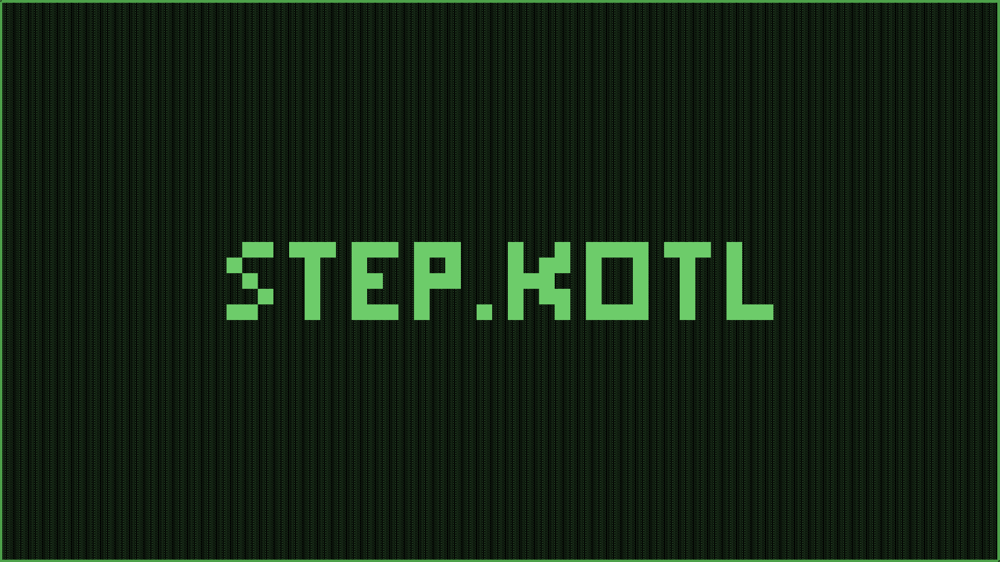

# Graphics Library using PPM and Python Classes

This project was created with the goal to input University of Waterloo diploma requirements and output a visual version of what was needed into a PPM file

---
## Some Example images (that I used to create my background for different devices):

.png)

---
## **This project is incomplete**

The following features are missing:
- Circles don't have increasing border sizes
- The webscraper
- The actual Visualiser

Known Bugs:
- When the border of squares is increased, the corners are missing some filled sports
